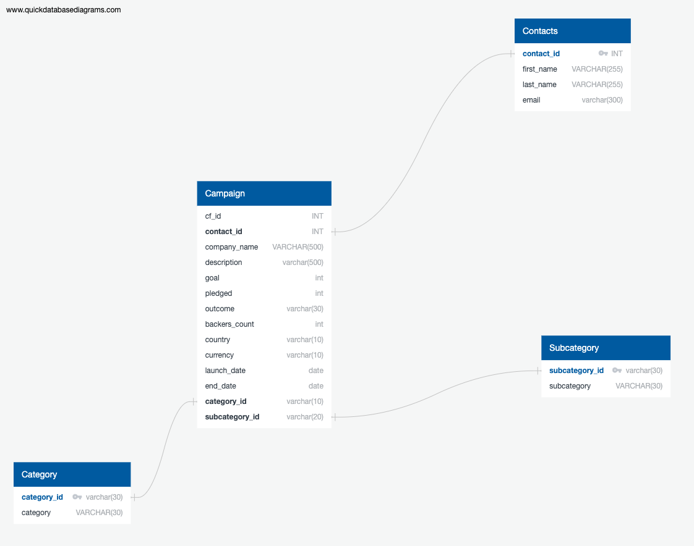

# Crowdfunding_ETL

## **Project Description**

Building an ETL pipeline using Python, Pandas, and either Python dictionary methods or regular expressions to extract and transform the data. After transforming the data, we created four CSV files and use the CSV file data to create an ERD and a table schema. Finally, we uploaded the CSV file data into a Postgres database.

## **Project Subsections**

1. Create the Category and Subcategory DataFrames
    - Extract and transform the 'crowdfunding.xlsx' Excel data to create a category DataFrame that has the following columns:
        - A "category_id" column that has entries going sequentially from "cat1" to "catn", where n is the number of unique categories
        - A "category" column that contains only the category titles
        - Export the category DataFrame as 'category.csv' (Located in our *[Resources](Resources)* folder)
    - Extract and transform the 'crowdfunding.xlsx' Excel data to create a subcategory DataFrame that has the following columns:
        - A "subcategory_id" column that has entries going sequentially from "subcat1" to "subcat*n*", where *n* is the number of unique subcategories
        - A "subcategory" column that contains only the subcategory titles
        - Export the subcategory DataFrame as 'subcategory.csv' (Located in our *[Resources](Resources)* folder)
1. Create the Campaign DataFrame
    - Extract and transform the 'crowdfunding.xlsx' Excel data to create a campaign DataFrame has the following columns:
        - The "cf_id" column
        - The "contact_id" column
        - The "company_name" column
        - The "blurb" column, renamed to "description"
        - The "goal" column, converted to the 'float' data type
        - The "pledged" column, converted to the 'float' data type
        - The "outcome" column
        - The "backers_count" column
        - The "country" column
        - The "currency" column
        - The "launched_at" column, renamed to "launch_date" and with the UTC times converted to the 'datetime' format
        - The "deadline" column, renamed to "end_date" and with the UTC times converted to the 'datetime' format
        - The "category_id" column, with unique identification numbers matching those in the "category_id" column of the category DataFrame
        - The "subcategory_id" column, with the unique identification numbers matching those in the "subcategory_id" column of the subcategory DataFrame
        - Export the campaign DataFrame as 'campaign.csv' (Located in our *[Resources](Resources)* folder)
1. Create the Contacts DataFrame
    - Use Python dictionary methods to extract and transform the data from the 'contacts.xlsx' Excel data:
        - Import the contacts.xlsx file into a DataFrame.
        - Iterate through the DataFrame, converting each row to a dictionary.
        - Iterate through each dictionary, doing the following:
            - Extract the dictionary values from the keys by using a Python list comprehension.
            - Add the values for each row to a new list.
            - Create a new DataFrame that contains the extracted data.
            - Split each "name" column value into a first and last name, and place each in a new column.
            - Clean and export the DataFrame as 'contacts.csv' (Located in our *[Resources](Resources)* folder)
1. Create the Crowdfunding Database
    - Inspect the four CSV files, and then sketch an ERD of the tables. 
        - Use the information from the ERD to create a table schema for each CSV file.
        - Save the database schema as a Postgres file (Located in our *[SQL](SQL)* folder)
        - Create a new Postgres database, named crowdfunding_db.
        - Using the database schema, create the tables in the correct order to handle the foreign keys.
        - Verify the table creation by running a SELECT statement for each table.
        - Import each CSV file into its corresponding SQL table.
        - Verify that each table has the correct data by running a SELECT statement for each.

### **Database Schema**

'''

drop table if exists category;
drop table if exists subcategory;
drop table if exists contacts;
drop table if exists campaign;

create table category (
category_id varchar(30) not null,
category varchar(30) not null,
primary key (category_id)
);

create table subcategory (
subcategory_id varchar(30) not null,
subcategory varchar(30) not null,
primary key (subcategory_id)
);

create table contacts (
contact_id INT  NOT NULL,
first_name VARCHAR(255)   NOT NULL,
last_name VARCHAR(255)   NOT NULL,
email varchar(300)   NOT NULL,
primary key (contact_id)
);

create table campaign (
cf_id int not null,
contact_id int not null,
company_name varchar(500) not null,
description varchar(500) not null,
goal int not null,
pledged int not null,
outcome varchar(20) not null,
backers_count int not null,
country varchar(10) not null,
currency varchar(10) not null,
launch_date date not null,
end_date date not null,
category_id varchar(10) not null,
subcategory_id varchar(20) not null,
foreign key (contact_id) references contacts (contact_id),
foreign key (category_id) references category (category_id),
foreign key (subcategory_id) references subcategory (subcategory_id)
);

select * from category ;
select * from subcategory ;
select * from contacts ;
select * from campaign ;
'''

